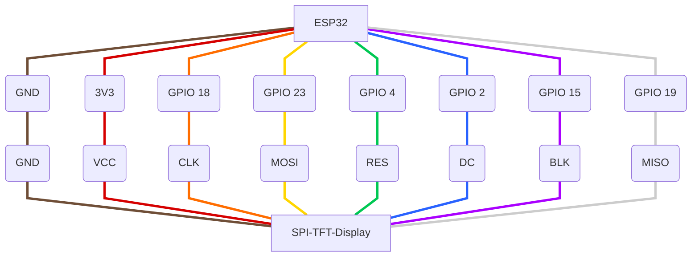

```mermaid
---
config:
  layout: fixed
---
flowchart TB
    B("GND") L_B_n1_0@=== n1["SPI-TFT-Display"]
    n2["VCC"] === n1
    n3["CLK"] === n1
    n4["MOSI"] === n1
    n5["RES"] === n1
    n6["DC"] === n1
    n7["BLK"] === n1
    n8["MISO"] === n1
    n9["GND"] L_n9_B_0@=== B
    n10["3V3"] === n2
    n11["GPIO 18"] === n3
    n12["GPIO 23"] === n4
    n13["GPIO 4"] === n5
    n14["GPIO 2"] === n6
    n15["GPIO 15"] === n7
    n16["GPIO 19"] === n8
    A["ESP32"] L_A_n9_0@=== n9 & n10 & n11 & n12 & n13 & n14 & n15 & n16

    n1@{ shape: rect}
    n2@{ shape: rounded}
    n3@{ shape: rounded}
    n4@{ shape: rounded}
    n5@{ shape: rounded}
    n6@{ shape: rounded}
    n7@{ shape: rounded}
    n8@{ shape: rounded}
    n9@{ shape: rounded}
    n10@{ shape: rounded}
    n11@{ shape: rounded}
    n12@{ shape: rounded}
    n13@{ shape: rounded}
    n14@{ shape: rounded}
    n15@{ shape: rounded}
    n16@{ shape: rounded}

    linkStyle 0 stroke:#6F4E37,fill:none
    linkStyle 1 stroke:#D50000,fill:none
    linkStyle 2 stroke:#FF6D00,fill:none
    linkStyle 3 stroke:#FFD600,fill:none
    linkStyle 4 stroke:#00C853,fill:none
    linkStyle 5 stroke:#2962FF,fill:none
    linkStyle 6 stroke:#AA00FF,fill:none
    linkStyle 7 stroke:#cccccc,fill:none
    linkStyle 8 stroke:#6F4E37,fill:none
    linkStyle 9 stroke:#D50000,fill:none
    linkStyle 10 stroke:#FF6D00,fill:none
    linkStyle 11 stroke:#FFD600,fill:none
    linkStyle 12 stroke:#00C853,fill:none
    linkStyle 13 stroke:#2962FF,fill:none
    linkStyle 14 stroke:#AA00FF,fill:none
    linkStyle 15 stroke:#cccccc,fill:none
    linkStyle 16 stroke:#6F4E37,fill:none
    linkStyle 17 stroke:#D50000,fill:none
    linkStyle 18 stroke:#FF6D00,fill:none
    linkStyle 19 stroke:#FFD600,fill:none
    linkStyle 20 stroke:#00C853,fill:none
    linkStyle 21 stroke:#2962FF,fill:none
    linkStyle 22 stroke:#AA00FF,fill:none
    linkStyle 23 stroke:#cccccc,fill:none

    L_B_n1_0@{ curve: linear } 
    L_n9_B_0@{ curve: linear } 
    L_A_n9_0@{ curve: linear } 
    L_A_n10_0@{ curve: linear } 
    L_A_n11_0@{ curve: linear } 
    L_A_n12_0@{ curve: linear } 
    L_A_n13_0@{ curve: linear } 
    L_A_n14_0@{ curve: linear } 
    L_A_n15_0@{ curve: linear } 
    L_A_n16_0@{ curve: linear }

    %% Alle Kanten linear
    linkStyle default interpolate linear
```